# TIKTOK DOWNLOAD PHOTO

## DESCRITPTION 
This source coded by Naufal Taufiq Ridwan
I git clone https://github.com/n0l3r/tiktok-downloader.git : 

But api in this source died and only download video

You can git clone from my source

I only fixed and change code download all video into download all photo of user and add free api tiktok 

Api from : https://gist.github.com/rastreador/b9ebc897f65eaaaf1e388396c8561e2d

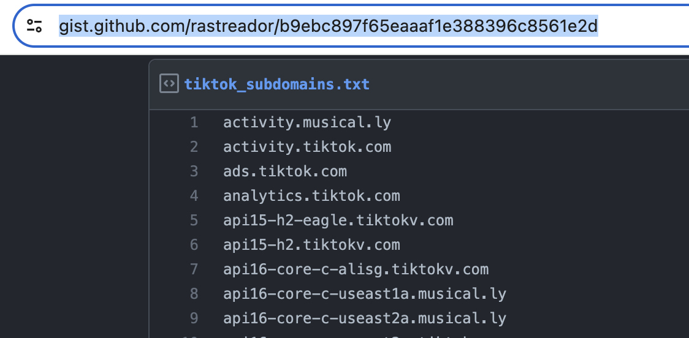

## Guide to download photo

` 1: git clone https://github.com/desigvietshop/tiktok-downloader-all-photo.git`

` 2: cd project and npm install`

` 3: node index` to run node application

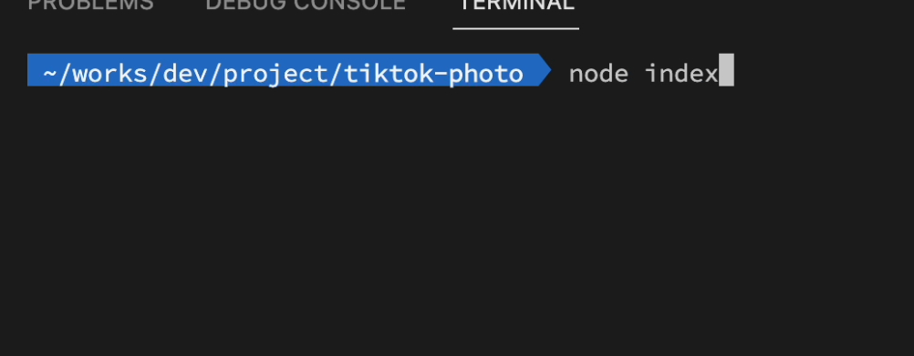

Select option like images belows :

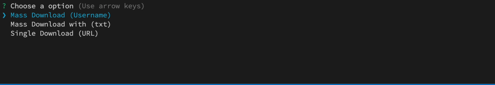

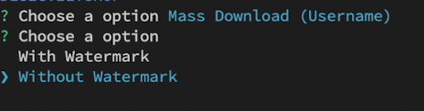

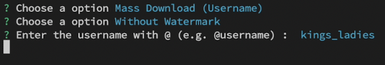

Capcha tiktok 

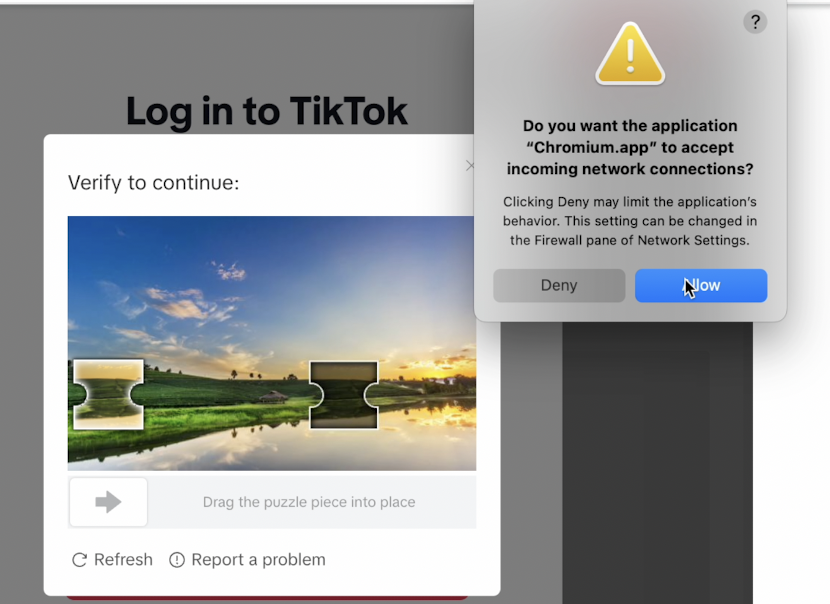

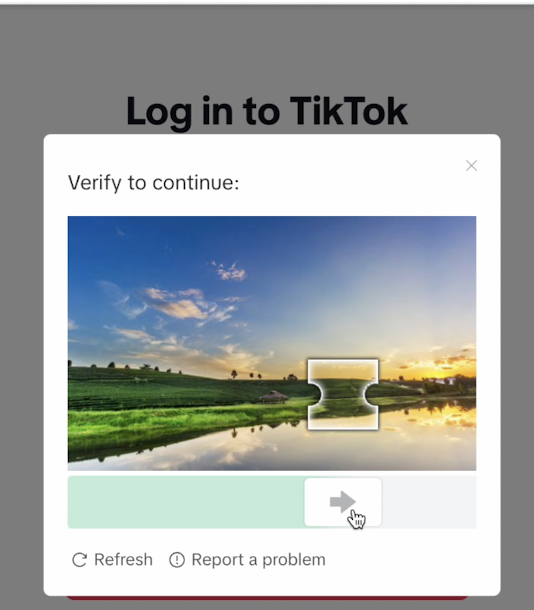

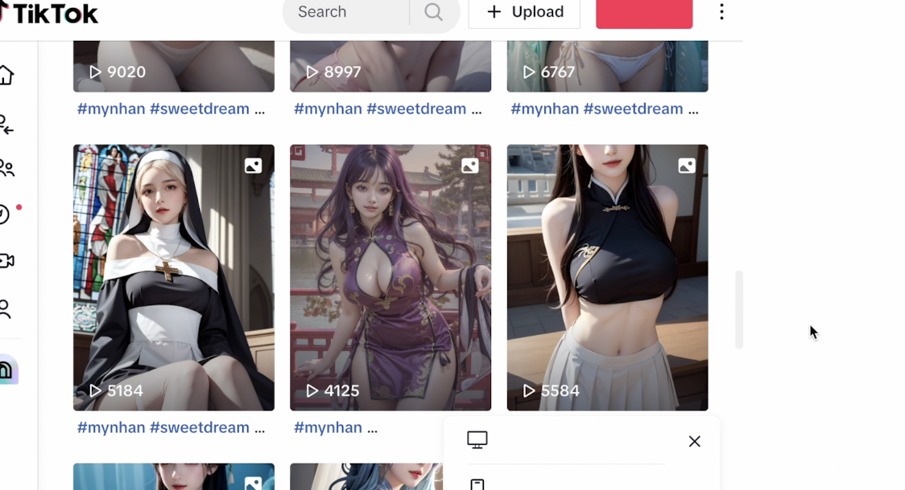

Applicate check user have how much photo slide want to download 

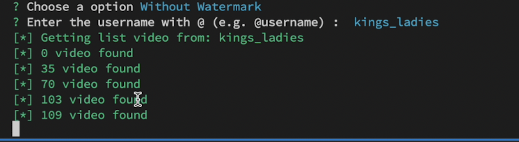

When applicate finish will show all the total photo video want to download

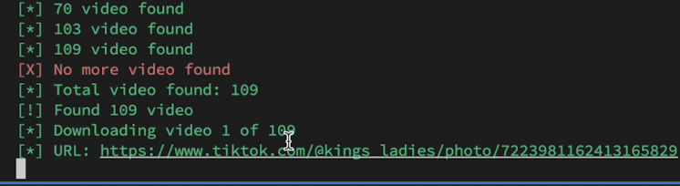

### Result

Photos **at** folder downloads 

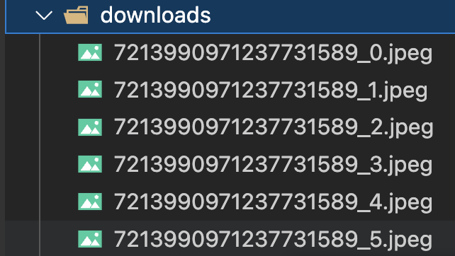

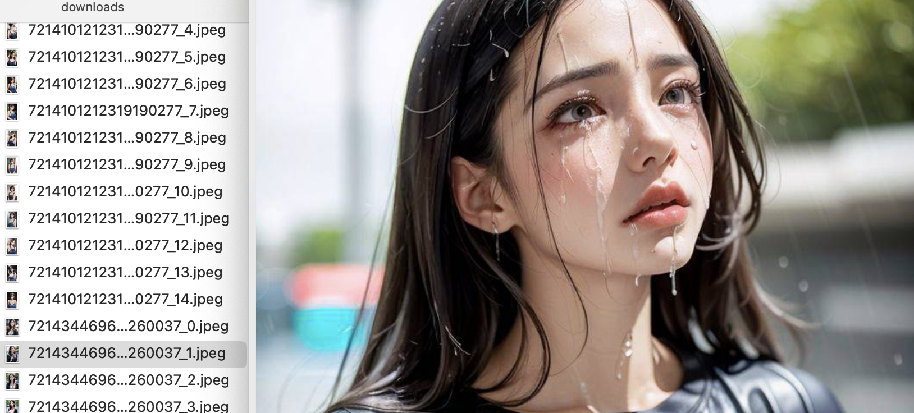

## Duplicate

- Photo is duplicate will show the yellow color link on the console
  
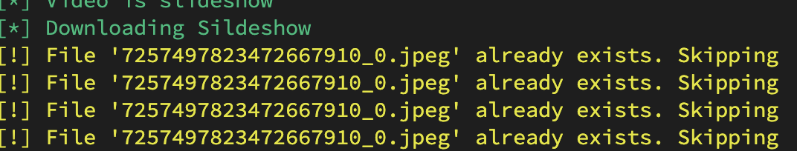

## Note :
if the link api die, you find the api tiktok on the list link i show above